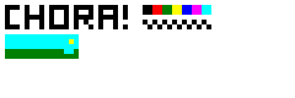
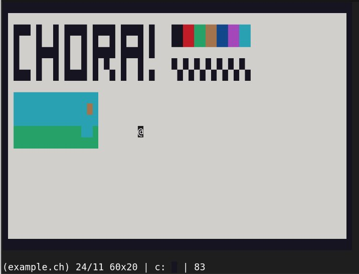

# ninachora

chora is a simple graphical terminal client for drawing pixel-art written in Lua.
Inspired by [pxltrm](https://github.com/dylanaraps/pxltrm).

|     |      |
| ---                              | ---                                 |
| SVG image created with chora     | The same image, opened in chora     |

# Usage

## Starting

```sh
$ chora [name] [x] [y]
```

Where:

* `[name]` is the name of your file (without brackets).
* `x` and `y` are the canvas' size.

## Controls

Movement uses the arrow keys.

The rest is also quite simple:

| KEY | FUNCTION                     |
| --- | ---                          |
| I   | Insert a pixel               |
| O   | take Out a pixel             | 
| C   | Choose a color (1 through 8) |
| L   | draw a Line (press twice)    |
| S   | Save to file                 |
| E   | Export as SVG or XPM         |
| Q   | Quit (will ask if unsaved)   |

## Supported formats

As of right now, chora supports exporting to SVG and X PixMaps (`.xpm`).
Only chora files (`.ch`) can be opened for (re)editing, but the program
will interpret files intelligently, so the file extension is optional.

## Name origin

From Swahili 'chora', which is the root word for 'to draw'.
